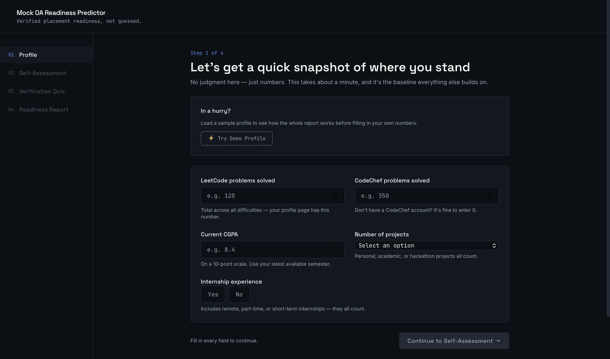
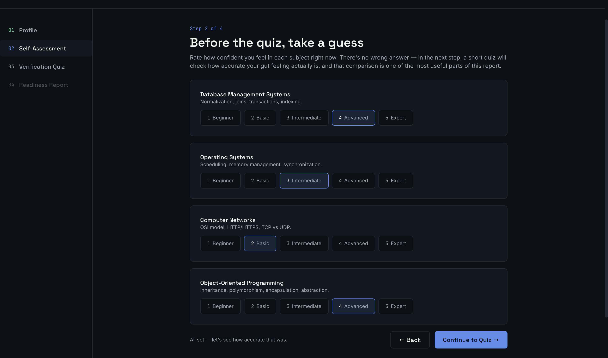
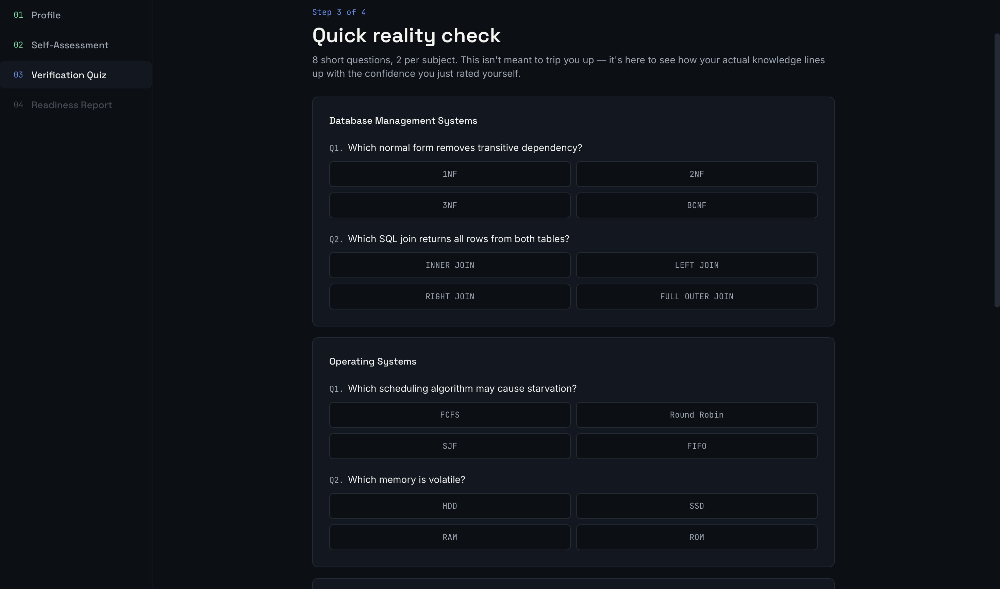
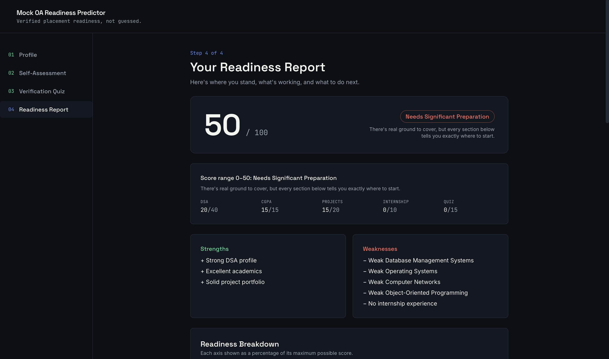
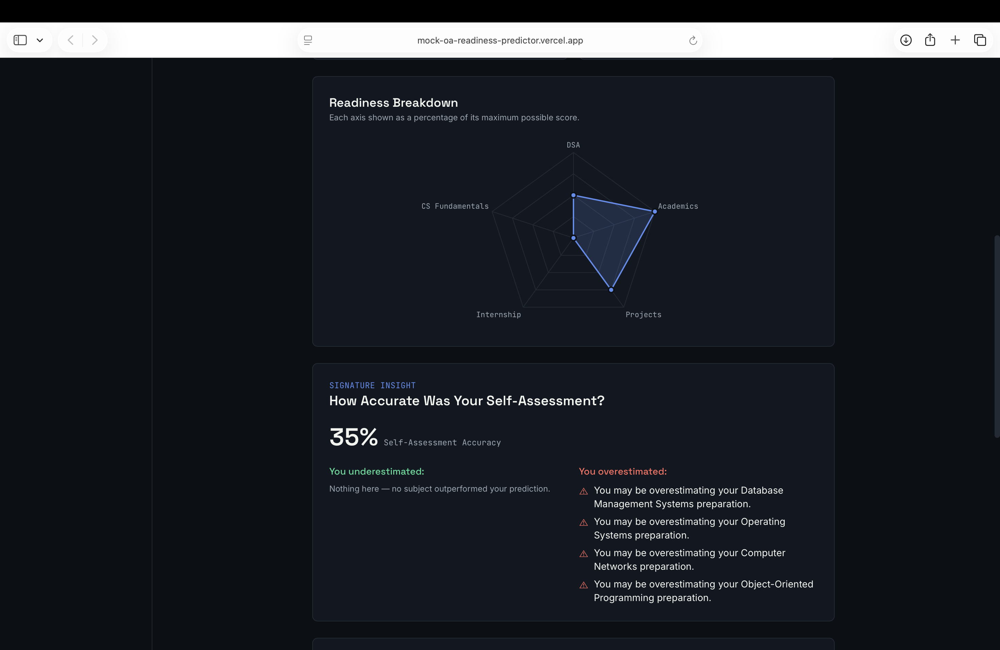

# PrepScore

**Placement Readiness Assessment Platform**

Measure your placement readiness with data, not guesswork.

PrepScore is a web-based assessment platform that evaluates a student's placement preparedness through profile analysis, self-assessment, technical verification quizzes, and personalized readiness reports.

---

## Live Demo

https://mock-oa-readiness-predictor.vercel.app

---

## Key Features

* Multi-step readiness assessment workflow
* Technical profile evaluation
* Subject-wise self-assessment
* Verification quizzes across core CS subjects
* Confidence vs Actual Performance analysis
* Placement readiness scoring engine
* Personalized improvement recommendations
* Interactive analytics dashboards

---

## Application Screenshots

### Profile Assessment



### Self Assessment



### Verification Quiz



### Readiness Report



### Final Assessment Dashboard



---

## How It Works

1. Enter academic and coding profile information.
2. Rate your confidence across core CS subjects.
3. Attempt a short verification quiz.
4. Compare self-perception against actual performance.
5. Receive a readiness score and personalized preparation roadmap.

---

## Tech Stack

* React 18
* Vite
* Tailwind CSS
* Chart.js
* React ChartJS 2

---

## Scoring Methodology

| Component             | Max Score |
| --------------------- | --------- |
| DSA Profile           | 40        |
| CGPA                  | 15        |
| Projects              | 20        |
| Internship Experience | 10        |
| Verification Quiz     | 15        |

The final readiness score is calculated using weighted contributions from academic performance, coding profile, project experience, internships, and quiz validation.

---

## Project Structure

```text
src/
├── data/
├── context/
├── utils/
├── components/
│   ├── layout/
│   ├── steps/
│   ├── results/
│   └── ui/
└── lib/
```

---

## Local Setup

```bash
npm install
npm run dev
```

Production Build:

```bash
npm run build
npm run preview
```

---

## Author

Ankur Singh

Computer Science Student
Dayananda Sagar College of Engineering
